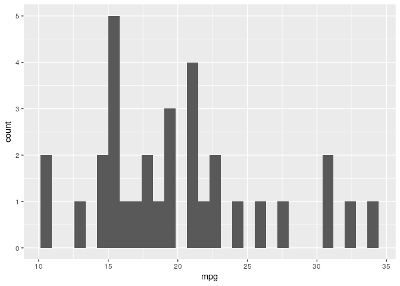

<!-- README.md is generated from README.Rmd. Please edit that file -->

# `nurser`

<!-- badges: start -->

[](https://github.com/UBC-MDS/nurser/actions)

[](https://codecov.io/gh/UBC-MDS/nurser)
<!-- badges: end -->

An R package for streamlining the front end of the machine learning
workflow.

### Summary

-----

Common to the front end of most machine learning pipelines is an
exploratory data analysis (EDA) and feature preprocessing. EDA’s
facilitate a better understanding of the data being analyzed and allows
for a targeted and more robust model development while feature
imputation and preprocessing is a requirement for many machine learning
alogirthms. `nurser` aims to streamline the front end of the machine
learning pipeline by generating descriptive summary tables and figures,
various feature imputation summaries, and automating preprocessing.
Automated preprocessing detection has been implemented to minimize time
and optimize the processing methods used. The functions in `nurser` were
developed to provide useful and informative metrics that are applicable
to a wide array of datasets.

A vignettes for this package can be found
[here](https://ubc-mds.github.io/nurser/).

*`nurser` was developed as part of DSCI 524 of the MDS program at UBC.*

### Installation:

-----

You can install the released version of nurser from CRAN with:

    install.packages("nurser")

The development version can be downloaded from
[GitHub](https://github.com/UBC-MDS/nurser) with:

    # install.packages("devtools")
    devtools::install_github("UBC-MDS/nurser")

### Features

-----

The package includes the following three
functions:

| Function         | Input                    | Output                                                                        | Description                                                                                           |
| ---------------- | ------------------------ | ----------------------------------------------------------------------------- | ----------------------------------------------------------------------------------------------------- |
| `eda`            | \- a dataframe           | \- a list that contains histogram and summary statistics for each column      | \- Functionality for easy explanatory data analysis.                                                  |
| `impute_summary` | \- a dataframe           | \- a list with summary statistics and outputs of different imputation methods | \- Functionality for consolidating several imputation methods                                         |
| `preproc`        | \- a tibble or dataframe | \- a tibble with preprocessed features                                        | \- Functionality for automatic feature preprocessing detection and user defined feature preprocessing |

### R Ecosystem

-----

`nurser` was developed to align with:

  - [tidyverse](https://www.tidyverse.org/)

The `impute_summary` function leveraged the imputation methods found in
the following
    packages:

  - [Hmisc](https://cran.r-project.org/web/packages/Hmisc/index.html)  
  - [mi](https://cran.r-project.org/web/packages/mi/index.html)  
  - [mice](https://cran.r-project.org/web/packages/mice/index.html)  
  - [missForest](https://cran.r-project.org/web/packages/missForest/index.html)

However, the functions herein streamline and automate the front-end
machine learning pipeline for use with any machine learning package.

### Dependencies

-----

  - ggplot2=3.3.0  
  - tibble=2.1.3  
  - fastDummies=1.6.1  
  - stats=3.6.2  
  - Hmisc=4.3-1  
  - mi=1.0  
  - mice=3.8.0  
  - missForest=1.4

### Usage

-----

``` r
library(nurser)
library(magrittr)
```

# `eda`

The `eda()` function return a list that contains histogram and summary
statistics for a given column. Let’s see it in action\!

</br>

To view a histogram of a feature:

    result <- eda(mtcars)

``` r
hist_mpg <- result$histograms[[1]]
hist_mpg
```

 </br>

Now let’s see the summary statistics of this feature:

``` r
stats_mpg = result$stats$mpg
stats_mpg
#>    Min. 1st Qu.  Median    Mean 3rd Qu.    Max. 
#>   10.40   15.43   19.20   20.09   22.80   33.90
```

-----

# `impute_summary`

Let’s import some continuous data to work with,

``` r
iris_data <- iris[1:4]
```

and add some missing values,

``` r
iris_missing <- 
  as.data.frame(lapply(iris_data, 
                       function(x) x[sample(c(TRUE, NA),
                                            size = length(x), 
                                            replace = TRUE,
                                            prob = c(0.75, 0.25))]))
```

Now, let’s take a look at the data to in fact see if the missing values
were generated and where they are:

``` r
iris_missing %>% head(10)
#>    Sepal.Length Sepal.Width Petal.Length Petal.Width
#> 1            NA          NA          1.4         0.2
#> 2            NA         3.0          1.4         0.2
#> 3           4.7          NA          1.3         0.2
#> 4           4.6         3.1           NA         0.2
#> 5           5.0          NA           NA         0.2
#> 6           5.4          NA          1.7         0.4
#> 7           4.6          NA           NA         0.3
#> 8           5.0         3.4          1.5         0.2
#> 9           4.4         2.9           NA         0.2
#> 10          4.9         3.1          1.5         0.1
```

Great, we have some missing values to compute - let’s call
`impute_summary` to get some summary statistics and outputs from
different methods.

    iris_imputed <- impute_summary(iris_missing)

`impute_summary()` provides some useful summary statistics and also
several imputed dataframes that can be accessed by the impute\_summary
object attributes. The imputed data frames provided include:

  - mean,  
  - median,  
  - max,  
  - min,  
  - random,  
  - multiple imputation,  
  - pmm, and  
  - random forest

Let’s first take a look at the summaries, which can be accessed using
**`$nan_counts`** (NA counts for each feature) and **`$nan_rowindex`**
(rows that contain NA values):

``` r
iris_imputed$nan_counts
#>              NaN_count
#> Sepal.Length        27
#> Sepal.Width         33
#> Petal.Length        27
#> Petal.Width         39
#> Total              126

iris_imputed$nan_rowindex %>% head(5)
#>   NaN_Rows
#> 1        1
#> 2        2
#> 3        3
#> 4        4
#> 5        5
```

</br>

Now, let’s take a look at two of the imputed data frames, **`mean`** and
**`multiple imputation`**:

``` r
iris_imputed$hmisc_mean %>% head(10)
#>    Sepal.Length Sepal.Width Petal.Length Petal.Width
#> 1       5.86748    3.020513     1.400000         0.2
#> 2       5.86748    3.000000     1.400000         0.2
#> 3       4.70000    3.020513     1.300000         0.2
#> 4       4.60000    3.100000     3.913008         0.2
#> 5       5.00000    3.020513     3.913008         0.2
#> 6       5.40000    3.020513     1.700000         0.4
#> 7       4.60000    3.020513     3.913008         0.3
#> 8       5.00000    3.400000     1.500000         0.2
#> 9       4.40000    2.900000     3.913008         0.2
#> 10      4.90000    3.100000     1.500000         0.1

iris_imputed$mi_multimp %>% head(10)
#>    Sepal.Length Sepal.Width Petal.Length Petal.Width
#> 1      5.177787    3.366429     1.400000         0.2
#> 2      4.886834    3.000000     1.400000         0.2
#> 3      4.700000    3.660624     1.300000         0.2
#> 4      4.600000    3.100000     1.185054         0.2
#> 5      5.000000    3.455096     1.226120         0.2
#> 6      5.400000    3.576222     1.700000         0.4
#> 7      4.600000    3.164563     2.341771         0.3
#> 8      5.000000    3.400000     1.500000         0.2
#> 9      4.400000    2.900000     1.549746         0.2
#> 10     4.900000    3.100000     1.500000         0.1
```

-----

# `preproc`

The `preproc()` function returns a tibble with preprocessed features.
Simply call `preproc` on your data\!

Let’s first view our data before preprocessing:

``` r
head(iris)
#>   Sepal.Length Sepal.Width Petal.Length Petal.Width Species
#> 1          5.1         3.5          1.4         0.2  setosa
#> 2          4.9         3.0          1.4         0.2  setosa
#> 3          4.7         3.2          1.3         0.2  setosa
#> 4          4.6         3.1          1.5         0.2  setosa
#> 5          5.0         3.6          1.4         0.2  setosa
#> 6          5.4         3.9          1.7         0.4  setosa
```

</br>

and now after calling `preproc`:

``` r
results = preproc(iris)
head(results)
#>   Sepal.Length Sepal.Width Petal.Length Petal.Width Species_versicolor
#> 1   -0.8976739  1.01560199    -1.335752   -1.311052                  0
#> 2   -1.1392005 -0.13153881    -1.335752   -1.311052                  0
#> 3   -1.3807271  0.32731751    -1.392399   -1.311052                  0
#> 4   -1.5014904  0.09788935    -1.279104   -1.311052                  0
#> 5   -1.0184372  1.24503015    -1.335752   -1.311052                  0
#> 6   -0.5353840  1.93331463    -1.165809   -1.048667                  0
#>   Species_virginica
#> 1                 0
#> 2                 0
#> 3                 0
#> 4                 0
#> 5                 0
#> 6                 0
```

-----

### Documentation

-----
